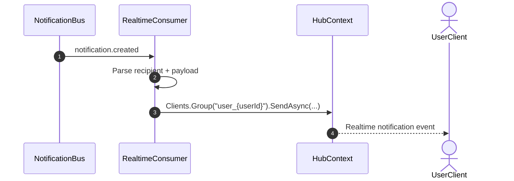

```mermaid
sequenceDiagram
    autonumber
    participant NotificationBus
    participant RealtimeConsumer
    participant HubContext
    actor UserClient

    NotificationBus->>RealtimeConsumer: notification.created
    RealtimeConsumer->>RealtimeConsumer: Parse recipient + payload
    RealtimeConsumer->>HubContext: Clients.Group("user_{userId}").SendAsync(...)
    HubContext-->>UserClient: Realtime notification event
```
