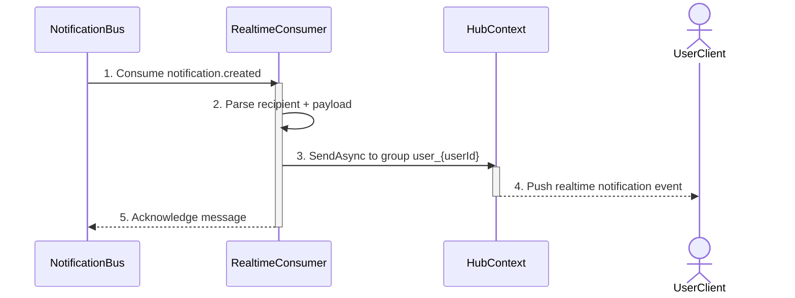

```mermaid
sequenceDiagram
    participant NotificationBus
    participant RealtimeConsumer
    participant HubContext
    actor UserClient

    NotificationBus->>RealtimeConsumer: 1. Consume notification.created
    activate RealtimeConsumer
    RealtimeConsumer->>RealtimeConsumer: 2. Parse recipient + payload
    RealtimeConsumer->>HubContext: 3. SendAsync to group user_{userId}
    activate HubContext
    HubContext-->>UserClient: 4. Push realtime notification event
    deactivate HubContext
    RealtimeConsumer-->>NotificationBus: 5. Acknowledge message
    deactivate RealtimeConsumer
```
