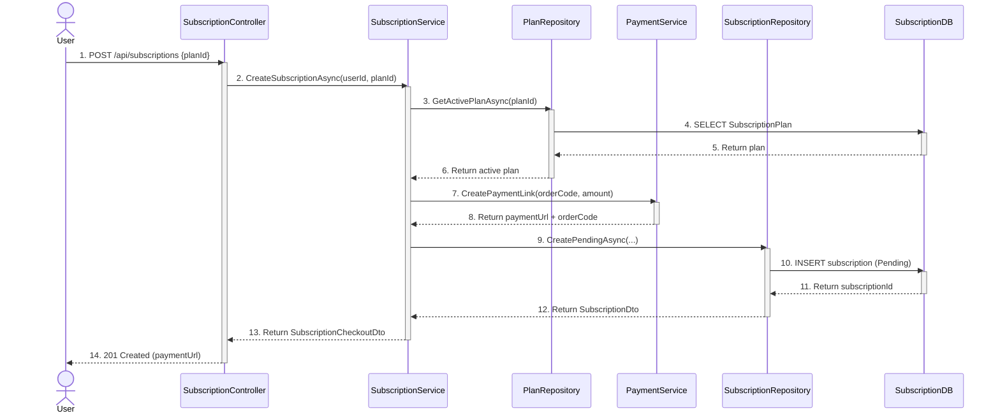

```mermaid
sequenceDiagram
    actor User
    participant SubscriptionController
    participant SubscriptionService
    participant PlanRepository
    participant PaymentService
    participant SubscriptionRepository
    participant SubscriptionDB

    User->>SubscriptionController: 1. POST /api/subscriptions {planId}
    activate SubscriptionController
    SubscriptionController->>SubscriptionService: 2. CreateSubscriptionAsync(userId, planId)
    activate SubscriptionService
    SubscriptionService->>PlanRepository: 3. GetActivePlanAsync(planId)
    activate PlanRepository
    PlanRepository->>SubscriptionDB: 4. SELECT SubscriptionPlan
    activate SubscriptionDB
    SubscriptionDB-->>PlanRepository: 5. Return plan
    deactivate SubscriptionDB
    PlanRepository-->>SubscriptionService: 6. Return active plan
    deactivate PlanRepository
    SubscriptionService->>PaymentService: 7. CreatePaymentLink(orderCode, amount)
    activate PaymentService
    PaymentService-->>SubscriptionService: 8. Return paymentUrl + orderCode
    deactivate PaymentService
    SubscriptionService->>SubscriptionRepository: 9. CreatePendingAsync(...)
    activate SubscriptionRepository
    SubscriptionRepository->>SubscriptionDB: 10. INSERT subscription (Pending)
    activate SubscriptionDB
    SubscriptionDB-->>SubscriptionRepository: 11. Return subscriptionId
    deactivate SubscriptionDB
    SubscriptionRepository-->>SubscriptionService: 12. Return SubscriptionDto
    deactivate SubscriptionRepository
    SubscriptionService-->>SubscriptionController: 13. Return SubscriptionCheckoutDto
    deactivate SubscriptionService
    SubscriptionController-->>User: 14. 201 Created (paymentUrl)
    deactivate SubscriptionController
```
