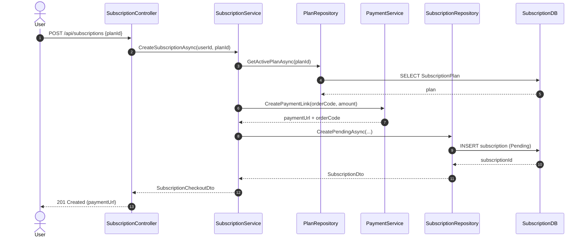

```mermaid
sequenceDiagram
    autonumber
    actor User
    participant SubscriptionController
    participant SubscriptionService
    participant PlanRepository
    participant PaymentService
    participant SubscriptionRepository
    participant SubscriptionDB

    User->>SubscriptionController: POST /api/subscriptions {planId}
    SubscriptionController->>SubscriptionService: CreateSubscriptionAsync(userId, planId)
    SubscriptionService->>PlanRepository: GetActivePlanAsync(planId)
    PlanRepository->>SubscriptionDB: SELECT SubscriptionPlan
    SubscriptionDB-->>PlanRepository: plan
    SubscriptionService->>PaymentService: CreatePaymentLink(orderCode, amount)
    PaymentService-->>SubscriptionService: paymentUrl + orderCode
    SubscriptionService->>SubscriptionRepository: CreatePendingAsync(...)
    SubscriptionRepository->>SubscriptionDB: INSERT subscription (Pending)
    SubscriptionDB-->>SubscriptionRepository: subscriptionId
    SubscriptionRepository-->>SubscriptionService: SubscriptionDto
    SubscriptionService-->>SubscriptionController: SubscriptionCheckoutDto
    SubscriptionController-->>User: 201 Created (paymentUrl)
```
