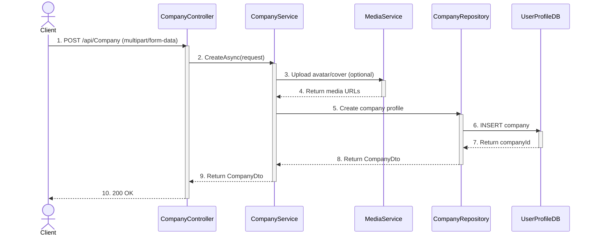

```mermaid
sequenceDiagram
    actor Client
    participant CompanyController
    participant CompanyService
    participant MediaService
    participant CompanyRepository
    participant UserProfileDB

    Client->>CompanyController: 1. POST /api/Company (multipart/form-data)
    activate CompanyController
    CompanyController->>CompanyService: 2. CreateAsync(request)
    activate CompanyService
    CompanyService->>MediaService: 3. Upload avatar/cover (optional)
    activate MediaService
    MediaService-->>CompanyService: 4. Return media URLs
    deactivate MediaService
    CompanyService->>CompanyRepository: 5. Create company profile
    activate CompanyRepository
    CompanyRepository->>UserProfileDB: 6. INSERT company
    activate UserProfileDB
    UserProfileDB-->>CompanyRepository: 7. Return companyId
    deactivate UserProfileDB
    CompanyRepository-->>CompanyService: 8. Return CompanyDto
    deactivate CompanyRepository
    CompanyService-->>CompanyController: 9. Return CompanyDto
    deactivate CompanyService
    CompanyController-->>Client: 10. 200 OK
    deactivate CompanyController
```
