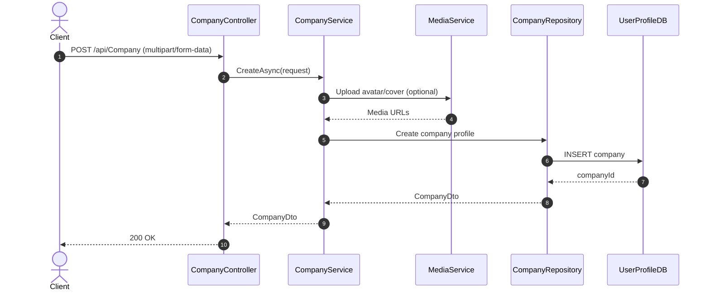

```mermaid
sequenceDiagram
    autonumber
    actor Client
    participant CompanyController
    participant CompanyService
    participant MediaService
    participant CompanyRepository
    participant UserProfileDB

    Client->>CompanyController: POST /api/Company (multipart/form-data)
    CompanyController->>CompanyService: CreateAsync(request)
    CompanyService->>MediaService: Upload avatar/cover (optional)
    MediaService-->>CompanyService: Media URLs
    CompanyService->>CompanyRepository: Create company profile
    CompanyRepository->>UserProfileDB: INSERT company
    UserProfileDB-->>CompanyRepository: companyId
    CompanyRepository-->>CompanyService: CompanyDto
    CompanyService-->>CompanyController: CompanyDto
    CompanyController-->>Client: 200 OK
```
